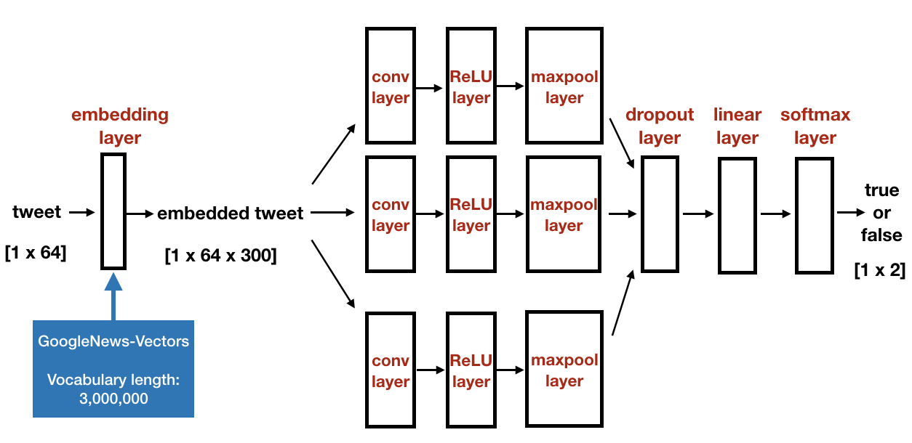

# UCInspire-2019

This is a repository for recording Yutong Wang's experience during the 10-week UCInspire program in UCI.


### Yutong Wang's Task List

> UCInspire 2019, Summer, 
>
> Yutong Wang, 
>
> Southern University of Science and Technology, Shenzhen, China.


- **Week 1 — 2(Working about 7 days): Responsible for temperature pipeline, including both historical data and recent data.**

  - Get familiar with the tempersture data: how the data looks like(file type, file size), what is the data update frequency.
  - Write crawler to crawl historical temperature data (tif files) from <ftp://ftp.ncdc.noaa.gov/pub/data/ghcn/daily/>
  - Write crawler to crawl recent temperature data (grib files) from NOAA website.
  - Work with Tingxuan to write grib extractor and tif extractor.
  - Write dumper to dump historical and recent temperature data, as well as soil moisture data into database.
  - Refactor crawler, dumper, extractor following base class.

  

- **Week 2 — 3(Working about 5 days): Responsible for Allennlp event2mind classifier.**

  - Use Allennlp to extract intents and reactions features from each tweets text.
  - Allennlp has pretrained models. If you input a text, then it outputs a list of intents & reactions with  corresponding probabilities.
  - Write event2mind classifier, dumper, runnable to extract X's intents, X's reactions, Y's reactions from each text records in database. Dump them and set up database for reaction, intent, and tweet-reaction-probability pair/tweet-intent-probability pair.

  

- **Week 3 — 4(Working about 5 days): Responsible for image classifier.**

  - Build training and testing dataset(around 2000 images) for images from tweet, wildfire or not wildfire. Hugo and I manually labeled the images to two classes: wildfire or not wildfire.
  - Design a Convolutional Neural Network framework, basically follows the VGG CNN framework.

```python
self.conv1 = nn.Conv2d(n_channels, 4, 3, stride=1, padding=1)
self.pool1 = nn.MaxPool2d(3, stride=2, padding=1)
self.conv1_ = nn.Conv2d(4, 8, 3, stride=1, padding=1)
self.pool1_ = nn.MaxPool2d(3, stride=2, padding=1)
self.conv2_ = nn.Conv2d(8, 16, 3, stride=1, padding=1)
self.pool2_ = nn.MaxPool2d(3, stride=2, padding=1)
self.conv3_ = nn.Conv2d(16, 32, 3, stride=1, padding=1)
self.pool3_ = nn.MaxPool2d(3, stride=2, padding=1)
self.conv4_ = nn.Conv2d(32, 64, 3, stride=1, padding=1)
self.pool4_ = nn.MaxPool2d(3, stride=2, padding=1)
self.conv2 = nn.Conv2d(64, 128, 3, stride=1, padding=1)
self.pool2 = nn.MaxPool2d(3, stride=2, padding=1)
self.conv3 = nn.Conv2d(128, 256, 3, stride=1, padding=1)
self.conv4 = nn.Conv2d(256, 256, 3, stride=1, padding=1)
self.pool3 = nn.MaxPool2d(3, stride=2, padding=1)
self.conv5 = nn.Conv2d(256, 512, 3, stride=1, padding=1)
self.conv6 = nn.Conv2d(512, 512, 3, stride=1, padding=1)
self.pool4 = nn.MaxPool2d(3, stride=2, padding=1)
self.conv7 = nn.Conv2d(512, 512, 3, stride=1, padding=1)
self.conv8 = nn.Conv2d(512, 512, 3, stride=1, padding=1)
self.pool5 = nn.MaxPool2d(3, stride=2, padding=1)
self.linear = nn.Linear(512, n_classes)
```

  

  - Set up training and testing process for VGG image classifier. 
    - Train process includes 4 epochs.
    - Testing accuracy is 80%, able to detect obvious smoke or fire as wildfire in the image.
  - Write image classifier, image classification dumper, and runnable. The process is to get urls from dataset, download images from urls, use CNN model to make predictions, dump prediction result into database. 
  - Combine two cnn models(vgg & resnet) into image classifiers. Use Hugo's ResNet model to make predictions on all images in dataset, dump them into database.
  - Calculate all the scores for VGG and ResNet models

  

- **Week 4(Working about 1 day): Responsible for a little function in task manager.**

  - Let user input parameters needed for the run() method of a specific class.
  - Make taskManager able to support more runnables.

  

- **Week 4 — 5(Working about 5 days): Responsible for tweets text classifier.**

  - First explore three existed tool (Stanford NLP, FastText, Allennlp) to try to process text. 

    <u>But I didn't find them useful, so I didn't use them to process text.</u>

  - Then learn **self-defined CNN framework from Zhihui** and use it for training process of text classification. The TextCNN framework basically follows this paper:

  > Y. Kim. Convolutional neural networks for sentence classification. In Proceedings of the 2014 Conference on Empirical Methods in Natural Language Processing (EMNLP), pages 1746–1751, Doha, Qatar, October 2014. Association for Computational Linguistics.

  ​	And the framework is as following:

  

  

  - Finish training process of text classification using CNN and get test accuracy higher than 85%. 
    - Training dataset contains 2000 records and testing dataset contains 800 records. 
    - Training process includes 4 epoch.
    - The textcnn model's input is one tweet record, the output is the probability of being wildfire and not wildfire.
  - Write dumper to dump some classification recult into records database.
  - Calculate all the scores for TextCNN models.

  

- **Week 6 — 7(Working about 9 days): Responsible for environmental CNN classification.**

  - Design a Convolutional neural network to predict the wildfire probability for each geolocations in a map.

    - Input is 9 images referring 9 different environmental features and the output is also an image, a.k.a. probability map.

  - Solve several challenges:

    1. Before, the cnn output is a vector, now the output becomes a 2d-matrix.
    2. Which loss function to use, solved by using MSE and KL.
    3. Convert images with different sizes and resolutions into same ones(CA range).

  - Finish training and testing process of wildfire prediction model based on 9 environmental features. The model is able to generate a geo-map with wildfire probability in each geo-loacation.

    - Training and testing dataset is made up of <u>two-months</u> environmental features and corresponding wildfire events infomation.
    - Calculate all the scores for this model.
    - Discuss the existing problem for this approach to generating probability map with Professor Chen Li and Professor Phu.

    

- **Week 7(Working about 1 day): Responsible for precipitation heatmap layer for frontend.**

  - Finish the precipitation heatmap layer but meet a problem:

    The transmitted data is too big, so the time is very consuming.

    

- **Week 8(Working about 2 days): Responsible for Environmental Probability Map for both frontend and presentation picture.**

  - Implement risk map heatmap layer in the frontend.

  - Generate some probability map numpy and images in five days using environment cnn modle for Riverside meeting.

    

- **Week 8(Working about 2 days): Three meetings.**

  - Meeting with Forest Service and NASA in Riverside.
  - Meeting with IBM for NLP discussion.
  - BOSS tutorial rehearsal.

  

- **Week 9 — 10(Working about 2 weeks): Responsible for Documentation.**

  - For the week 9, I temporarily helped Yicong to lead the team for documentation with Yichi. 
    - Finish most of docstrings and comments for code. 
    - Review each other's PR.
    - Write some WIKI documents.
